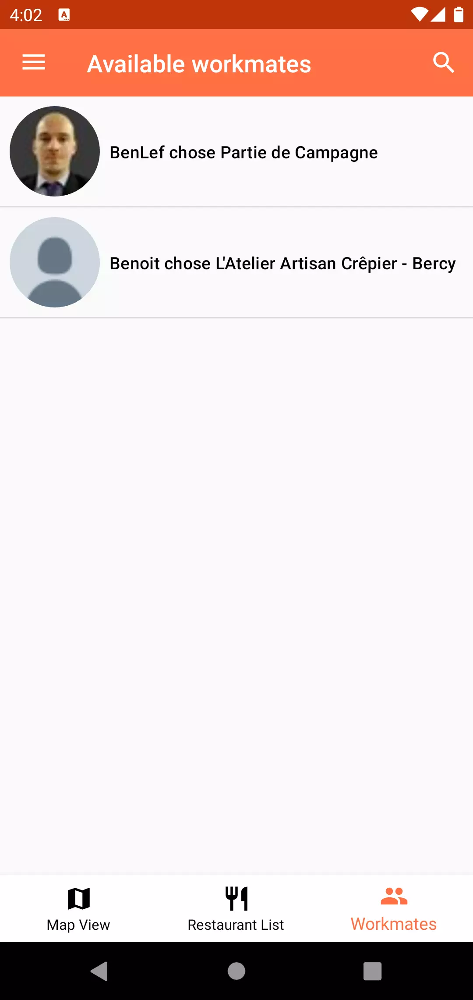

# Go4Lunch

An Android app that allows you to choose a restaurant where you want to lunch.  
You can see where your colleagues want to lunch and they can see what restaurant you choose for lunch.

## Description

This app is developped in Java.

Training to use :

    - Firebase Auth
    - Firestore
    - Firebase Messaging
    - Google Cloud Functions
    - GoogleMap
    - Place API
    - Callback
    - Notification
    - WorkManager

## Features

    - Auth with mail, Google, Facebook and Twitter
    - See your location on a map
    - See all restaurants around you on the map and if someone choosen this restaurant
    - See all restaurants around you in a list 
    - Search a restaurant around you with autoComplete options
    - See the number of users and the rating for all restaurants
    - See where your colleagues want to eat
    - See all your colleagues in a list with their choices of restaurant
    - Receive a notification at 12:00 if you choosen a restaurant

## Run on 

After downloading or clone the repository, you need to create a new project in Firebase and Google Cloud Platform (think to restrict your apikey with your SHA-1 and the correct API).  

In Google Cloud Platform you have to activate :  

    - Google Map
    - Google Place API

Add your google platform apikey in :

    - go4lunch/gradle.properties
      - GOOGLE_MAPS_API_KEY="xxxxxxxxxxxxxxxxxxxxxx"

In Firebase, you have to activate :

    - Auth (with all needed providers and their own key and secret key)
    - Firestore (nothing to do)

Add your Firebase configuration file in :

    - go4lunch/app/google-service.json

After these operations the app is ready.

## Documentation

You can find a french documentation video  at :

    -assets/documentation/demo.mp4
[Go to documentation](https://github.com/Benlefevre/Go4Lunch/blob/master/assets/documentation/demo.mp4)

## Screenshot

### Login screen

### Auth by mail

### Auth by Google

### Auth by Facebbok

### Auth by Twitter

### Permissions

### Home Screen

### Click on a marker

### Restaurant screen

### Home screen with selected restaurant

### Restaurant list

### Search field

### List with number of colleagues in a restaurant

### List of colleagues

